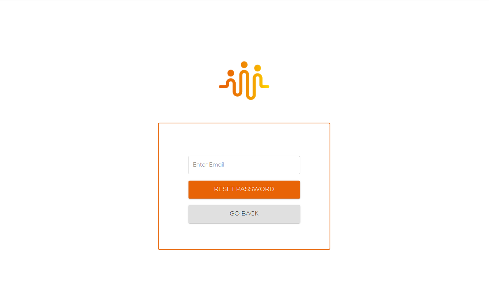
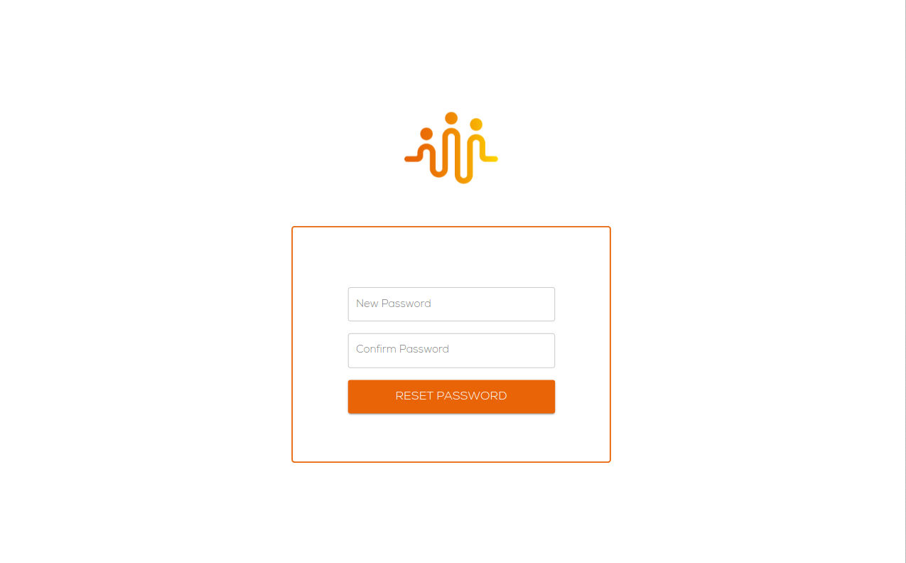
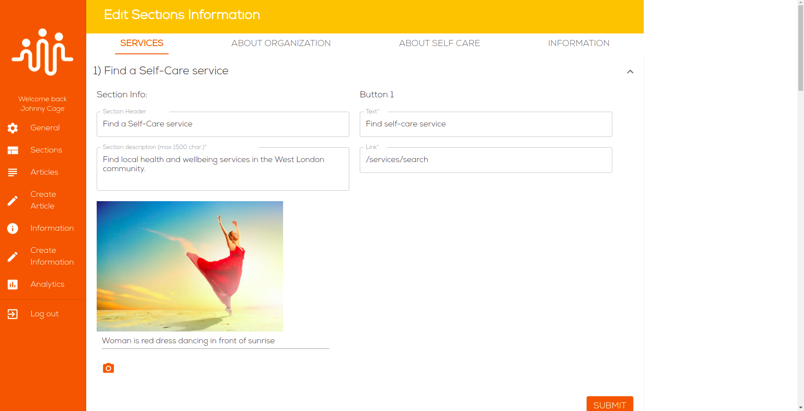

# CHWL Admin Interface Manual

## Description

In this document we provide all necessary information on how Admin interface can be used to edit and update all information that is on Community Health West London public website.

## 1. Log In

To protect Admin interface from unauthorized access the user is required to use predefined credentials to log-in. The required fields are email and password. After filling those fields with correct credentials and pressing Login button user will be redirected to General Dashboard.

*Preview of Log In interface*

### 1.1 Password Reset

In case if password has been forgotten there is password reset flow. After pressing  you will be redirected to reset password page.

*Reset Password Page*

Here you need to type in an email and press RESET PASSWORD button. If an email you typed is registered in database, system will send further instructions as well as a link to set a new password to this email. By proceeding by the link in email you will be redirected to the page where you can set a new password, if successful you will be redirected to log-in page where you can use new credentials to log in.

*New Password Page*

## 2. Navigation

All content of the website can be edited using forms. To Navigate to the particular form use the sidebar. On mobile the sidebar is accessible by clicking the menu button 

*Sidebar*  

All forms are grouped into dashboards to make it easy to find a correct form. Following chapters will go through each of the dashboards in details.

## 3. General Dashboard

After logging in, you will be redirecting to General Dashboard that will let you edit information in Footer and Tagline using corresponding form. Each form is collapsible by clicking the form's title.

*Previw General Dashboard*

*if all forms are collapsed*

If not edited, forms display the same information as on public site. When you enter new information and press  button the information you entered will be updated in database and displayed on public site.

### 3.1 Editing Footer

The second form in the General Dashboard lets you update Footer information. You can update text about CHWL, copyright and accessability disclaimers. The character count is limited to preserve page layout.

*Footer form*  

Once the necessary changes has been made, click the  to update footer.

### 3.2 Editing Tagline

Tagline is the text displayed under the CHWL logo on the landing page on public website.

*Tagline form*  

Once the necessary changes has been made, click the  to update tagline.

### 4 Navigation Dashboard

Admin interface provides ability to edit navigation tabs labels and where they lead. The route will be auto generated based on label that's been put in (ex. News & Info => /news_info). Currently there is no ability to add / remove navigation tabs

*main tabs on public website*

*secondary tabs on public website*

Try to make labels as short and descriptive as possible, user experience is greatly dependent on it.

*Navigation Dashboard*  

Once the necessary changes has been made, click the  to update navigation.

## 5 Testimonials Dashboard

Testimonials dashboard lest you edit existing testimonials and create new ones.

*Testimonials Dashboard*  

### 5.1 Editing a Testimonial

When  button is pressed it will oped testimonial edit form that lets you edit all information concerning given testimonial. You can change person's Name, Testimonial Text, Picture, Alt attribute that holds description of what is depicted on the picture (for accessability purposes) and link to the full article that will be opened when visitor presses Learn More button. Note that if you put links to external websites you have to specify the full address `https://website.com/etc...`. If you want to redirect to a article on CHWL public website, you have to create this article (Section 6 of manual) and then copy the URL from the browser window and paste to the `Link to Full Article` field and press `Submit`.

*example of testimonial form and corresponding card*  

Once the necessary changes has been made, click the  to update testimonial.

### 5.2 Creating new Testimonial

By pressing  button on `Testimonial Dashboard` you will be redirected to a page with form to create new testimonial

*new testimonial form*  

You can add an image by pressing  that will open dialog to choose a file. After a file is chosen the image will be displayed in the form. Then you have to fill up all the rest of the fields such as Name, Testimonial Text, Alt. (describe what is depicted on the picture you added, necessary for accessability reasons) and Link to Full Article. After all fields have been filled press `Submit` button to make this testimonial public.

<!-- ## 4. Editing Page Information
*Previw Sections Dashboard*

Tab Sections in Sidebar will take you to the Dashboard to edit information listed on following pages of public website: Services, About Organization, About Self Care and Information. To access forms of page you want to edit use top navigation menu.

*Top Navigation Menu*

Each form you see in the view corresponds to a section on the public website. The order of form is also the same.

*example of section on public website and corresponding form*  

*and corresponding form*  

Forms are collapsible by clicking the header to reduce amount of scrolling.

*all forms apart from Plans are collapsed *  

Form allows you to edit sections **Header**, **Description** by filling corresponding fields. The number of characters is limited to preserve the layout of the page.

The image can also be updated by uploading new one using the orange camera button 

Pay attention on the text field right below the image! It allow you to edit **alt** attribute that should have the description of what is depicted on the image. It is important for accessability purpose as this attribute is what will be available for screen readers.

Some sections have buttons, some don't. Currently there is no functionality to add or remove buttons but you can edit their label and the link to which they will redirect.

*example of two button form*  

After you made all necessary changes press  button in the bottom right corner of the form to update the section on the public website. If the update was successful you will see Success message in the bottom right corner of Error message if something went wrong

*example of success message*  

*example of error message*  

Some section do not hold a picture. They will have simplified form with increased number of characters in the description.

*example of form without image*  

### 4.1 Editing Partners Carousel

Other type of form is one to edit Our Partners carousel in About Organization view. It allows to separately edit section header by filling in the input and clicking Change Header button.

*form to edit carousel header*  

The content of carousel cards is also editable. Firstly the visibility of card can be toggled using the switch.  Secondly the image and the alt attribute can be updated. Thirdly the name of the partner organization and ist description, and lastly the partner's web and social media links. Each card is updated individually by pressing Submit button.

*example of form and corresponding card*  

There is also a functionality to add new card bu pressing . This will open a form that will let you create new card by filling required fields.
 -->

## 6. Articles Dashboard

Here you can see the list of all articles, their title, when and by whom they were created. You can also preview, edit, publish and un-publish existing articles.

*Articles dashboard*

To quickly see which articles are published and toggle published status use the `switch`. When the article is published (can be acessed from the CHWL public site) the switch looks like this , when it is hidden like this . Clicking on switch toggles article between `published` and `hidden` states.

### 5.1 Article Preview Modal

Clicking  button opens the modal that display how the article looks like on the public site. Close modal to return to Article dashboard.

*Article preview modal*  

### 5.2 Article Edit Modal
Clicking  will open form to edit the Article. Here you can change title, image (by pressing ), image's alt attribute (text that screen readers read) and body of the article.

*Article edit form*  
  

After you made necessary changes press `Submit` button. If successful changes you made will be reflected on the public site.

### 5.3 Create Article

Clicking on  will open the form that allow you to write new article, Date and Author of the article are added automatically.

*Article creation form*  
  

All fields are required, pay attention to Image Alt. fields it is an attribute that is important for accessability as it will be available to screen readers. It should contain description of what is depicted on the image you uploaded.

## 6 Information Dashboard

Here You can see All Information snippets/cards on the public site. You can see their header and description and can choose if you want to display them and pin them.

*Information dashboard*  
  

### 6.1 Create Information Snippets

To create new information snippets/cards press . Decide if you want it to be published or pinned when created. Add header description and Link.

*Create information snippet*  
  

### 6.2 Edit Information Snippets

To edit existing information snippets/cards press . It will open a form where you can change Header, Description and link to where you would like to redirect on click.

*Create information snippet*  
  
