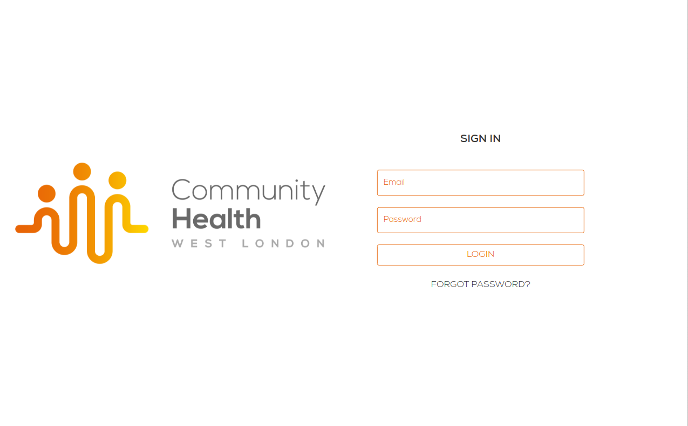
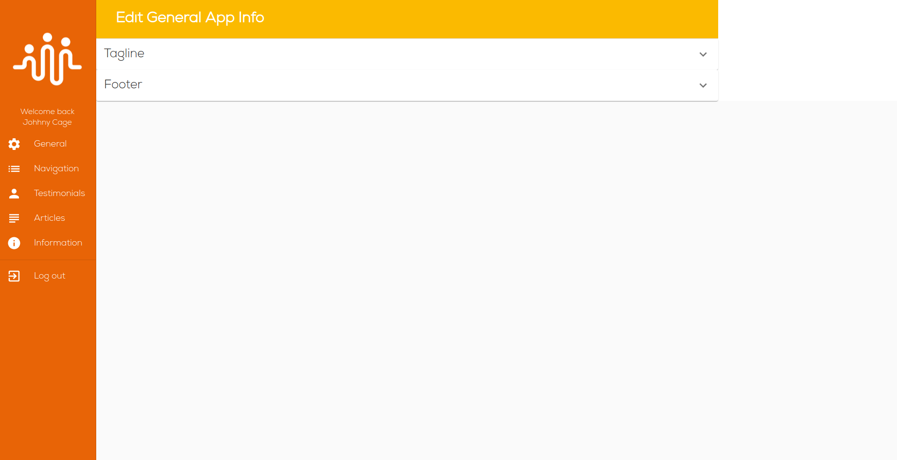

# CHWL Admin Interface Manual

## Description

In this document we provide all necessary information on how Admin interface can be used to edit and update all information that is on Community Health West London public website.

## 1. Log In

To protect Admin interface from unauthorized access the user is required to use predefined credentials to log-in. The required fields are email and password. After filling those fields with correct credentials and pressing Login button user will be redirected to General Dashboard.

*Preview of Log In interface*

## 2. Navigation

All content of the website can be edited using forms. To Navigate to the particular form use the sidebar. On mobile the sidebar is accessible by clicking the menu button 

*Sidebar*  

All forms are grouped into dashboards to make it easy to find a correct form. Following chapters will go through each of the dashboards in details.

## 3. General Dashboard

After logging in, you will be redirecting to General Dashboard that will let you edit information of Testimonials, site Navigation and Footer using corresponding form. Each form is collapsible by clicking the form's title.

*Previw General Dashboard*

*if all forms but Footer are collapsed*

### 3.1 Editing Testimonials

Currently there are two testimonials that can be edited. You can change person's Name, Testimonial Text, Picture, Alt attribute that holds description of what is depicted on the picture (for accessability purposes) and link to the full article. Note that if you put links to external websites you have to specify the full address `https://website.com/etc...`. If you want to redirect to a page on public website you can skip the part up to `.uk`, as an example `/news_info/articles/2`.

*example of testimonial form and corresponding card*  

Once the necessary changes has been made, click the  to update testimonial.

### 3.2 Editing Navigation

Admin interface provides ability to edit navigation tabs labels and where they lead. Be very careful with this feature as it is possible to break the scrolling on the Services page if incorrect ref parameters are provided.

There are two types of Tabs: main and secondary. For main tabs only the label and visibility can be edited. The route will be auto generated based on label that put in (ex. News & Info => /news_info).

*main tabs on public website*

Secondary Tabs come in two types, with and without ref. parameter. Secondary Tabs in section Services have this parameter as it is responsible for scroll effect. The ref parameter should be equal to the Title of the section to which it should scroll to.

*secondary tabs on public website*

*part of the navigation edit form*  

Once the necessary changes has been made, click the  to update navigation.

### 3.3 Editing Footer

The last form in the General Dashboard lets you update Footer information. You can update text about CHWL, copyright and accessability disclaimers. The character count is limited to preserve page layout.

*Footer form*  

Once the necessary changes has been made, click the  to update footer.

## 4. Editing Page Information

*Previw Sections Dashboard*

Tab Sections in Sidebar will take you to the Dashboard to edit information listed on following pages of public website: Services, About Organization, About Self Care and Information. To access forms of page you want to edit use top navigation menu.

*Top Navigation Menu*

Each form you see in the view corresponds to a section on the public website. The order of form is also the same.

*example of section on public website and corresponding form*  

*and corresponding form*  

Forms are collapsible by clicking the header to reduce amount of scrolling.

*all forms apart from Plans are collapsed *  

Form allows you to edit sections **Header**, **Description** by filling corresponding fields. The number of characters is limited to preserve the layout of the page.

The image can also be updated by uploading new one using the orange camera button 

Pay attention on the text field right below the image! It allow you to edit **alt** attribute that should have the description of what is depicted on the image. It is important for accessability purpose as this attribute is what will be available for screen readers.

Some sections have buttons, some don't. Currently there is no functionality to add or remove buttons but you can edit their label and the link to which they will redirect.

*example of two button form*  

After you made all necessary changes press  button in the bottom right corner of the form to update the section on the public website. If the update was successful you will see Success message in the bottom right corner of Error message if something went wrong

*example of success message*  

*example of error message*  

Some section do not hold a picture. They will have simplified form with increased number of characters in the description.

*example of form without image*  

### 4.1 Editing Partners Carousel

Other type of form is one to edit Our Partners carousel in About Organization view. It allows to separately edit section header by filling in the input and clicking Change Header button.

*form to edit carousel header*  

The content of carousel cards is also editable. Firstly the visibility of card can be toggled using the switch.  Secondly the image and the alt attribute can be updated. Thirdly the name of the partner organization and ist description, and lastly the partner's web and social media links. Each card is updated individually by pressing Submit button.

*example of form and corresponding card*  

There is also a functionality to add new card bu pressing . This will open a form that will let you create new card by filling required fields.

## 5. Articles Dashboard

Here you can see the list of all articles, their title, when and by whom they were created. You can also preview, edit, publish and un-publish existing articles.

*Articles dashboard with legend*  

**Legend:**
1. Navigation to Article Dashboard
2. Toggle if the Article is shown(published) on the site or if it's not(hidden)
3. Title of the Articles
4. Author of the Article (The name of the person who was logged in and created the Article)
5. Date of when the Article was created
6. Preview button to see how the article looks on website and Edit button where you can edit (title, body, image of the article)

### 5.1 Article Preview Modal

Clicking  button opens the modal that display how the article looks like on the public site. Close modal to return to Article dashboard.

*Article preview modal*  

### 5.2 Article Edit Modal
Clicking  will open form to edit the Article. Here you can change title, image, image's alt attribute (text that screen readers read) and body of the article.

*Article edit modal and Legend*  
  
**Legend:**
1. Edit title of the Article
2. Image preview
3. Change image alt text
4. Upload image button (max 1 image)
5. Edit body of the Article
6. Close modal without saving
7. Submit Article to save and update it

### 5.3 Create Article

Below the Articles tab on sidebar there is a Create Article tab. It leads to the form that allow you to write new article Date and Author are added automatically.

*Article edit modal and Legend*  
  
**Legend:**
1. Navigate to create Article form
2. Write Article title
3. Write Article body
4. Write image alt text (text that screen reader reads and is show if slow/broken image)
5. Upload one image to article (max 1 image)
6. Save and send it to the article dashboard. (you will also get re directed to the Article dashboard when pressing submit)

## 6 Information Dashboard

Here You can see All Information snippets/cards on the public site. You can see their header and description and can choose if you want to display them and pin them.

*Information dashboard and legend*  
  
**Legend:**
1. Navigate to Information Dashboard
2. Toggle if the Info is shown(published) on the site or if it's not(hidden)
3. Toggle if the Info is Pinned or not(other), If pinned it displays among other pinned infos at the top of the info page on the public site. If Other is toggled it displays underneath the pinned ones on the page among the other Infos with Other toggled.
4. Display the Header of the Info Snippet/Card
5. Display the Description of the Info Snippet/Card

### 6.1 Create Information Snippets

To create new information snippets/cards go to Create Information. Decide if you want it to be published or pinned when created. Add header description and Link.

*Create information snippet form and legend*  
  
**Legend:**
1. Navigate to Information Create
2. Toggle if Published (Checked = Published)
3. Toggled if Pinned (Checked = Pinned)
4. Add Header to Info
5. Add description to info
6. Add Link that leads to different page when clicked on the Client site
7. Click to save and submit the Info and it will appear on the Information Dashboard and you will get redirected to the Information Dashboard

